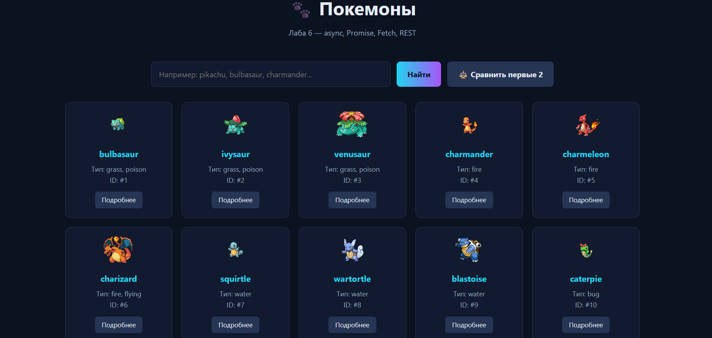

# api-client-anarbaeva

**Тема:** Лаба 6 — async, Promise, Fetch, REST. Клиент PokeAPI.
**Автор:** Анарбаева Акерке

## 🌐 Какой API используется

**PokeAPI** — публичный бесплатный API покемонов, без ключа.

**Base URL:** `https://pokeapi.co/api/v2`

## 🚀 Как открыть

Открыть `index.html` через **Live Server** (в VS Code: правой кнопкой по файлу → Open with Live Server).

## Что сделано

1. **Загрузка данных** — `fetch` + `async/await`, вывод карточками (спрайт, имя, типы, id)
2. **Loading и error states** — спиннер во время запроса, красная плашка при ошибке
3. **Поиск с параметром** — запрос уходит на `/pokemon/{name}`, а не фильтрует старый список
4. **Детали по id** — второй запрос на `/pokemon/{name}` при клике на карточку
5. **Promise.all** — сравнение двух покемонов параллельно через `Promise.all`

## Что делает await и зачем проверять response.ok

`await` приостанавливает выполнение функции, пока промис не разрешится — это позволяет писать асинхронный код так, будто он синхронный. Без `await` мы бы получили сам Promise, а не данные, и пришлось бы использовать `.then()`.

Проверка `response.ok` нужна потому, что **fetch не отклоняет промис при HTTP-ошибках** (например, 404 или 500). Он считает успешным любой ответ от сервера. Поэтому мы явно проверяем `response.ok` (это `true` для статусов 200–299) и вручную бросаем ошибку `throw new Error(...)` — только тогда сработает `catch` и пользователь увидит понятное сообщение вместо пустой страницы.

## Скриншот

